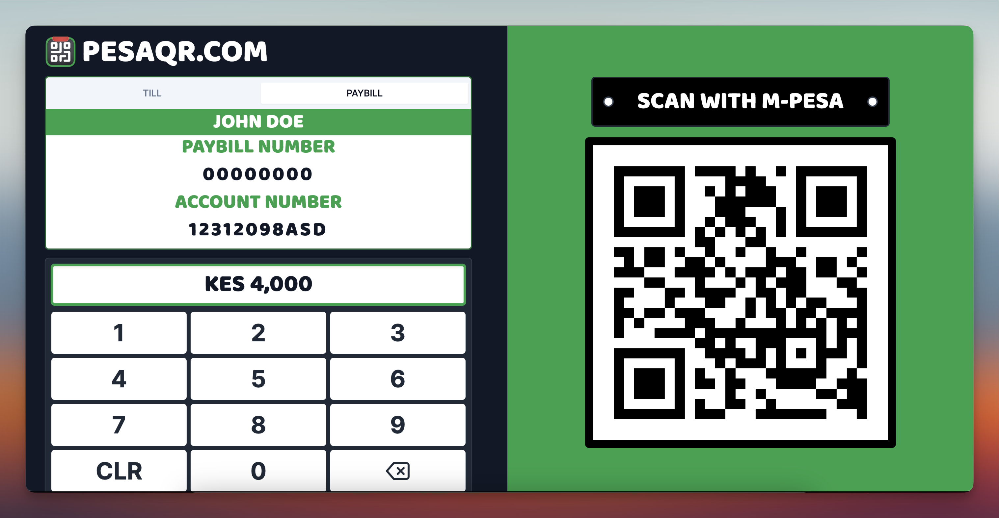

<div align="center">

<h1>PESAQR</h1>
</div>

This is a Customer Panel to generate M-PESA Payment QR Codes for any Till/Paybill.

I built this to help individuals/businesses opt consider providing customer payment terminals. Currently the [M-PESA app](https://play.google.com/store/apps/details?id=com.safaricom.mpesa.lifestyle&hl=en) is the most used finance app in the Android/iOS appstores.

The 'Scan QR to Pay' feature exists but isn't widely used. I discovered this while shopping in a supermarket and found it faster than keying in the store details or waiting for a payment prompt from the teller.

Discovered it was a simple sequence , built a v1 and now anyone can use this in their business that makes paying for things 3s faster !

Its free , offline and will stay that way.

---

## Run Locally

Clone the project

```bash
  git clone https://github.com/DavidAmunga/pesaqr
```

Go to the project directory

```bash
  cd pesaqr
```

Install dependencies

```bash
  npm install
```

Start the project

```bash
  npm run dev
```

## Tech Stack

React,TailwindCSS

## Screenshots




## Roadmap

- Better Responsiveness on Android Tablets
- Add Withdraw Cash QR
- Add Deploy to own hosting platform

## Lessons Learned

1. Proper Install Prompts is critical for adoption of PWA's
2. Offline-Only apps have their limitations but can be made better if their value is optimized. (No Self Hosted headaches)

## Demo

→ [pesaqr.com](pesaqr.com)

## License

[MIT](https://choosealicense.com/licenses/mit/)

## 🔗 Links

[](https://davidamunga.com)
[](https://www.linkedin.com/in/david-amunga)
[](https://twitter.com/davidamunga_)

## Feedback

If you have any feedback, please shoot a [DM me](https://twitter.com/davidamunga_) directly via X
